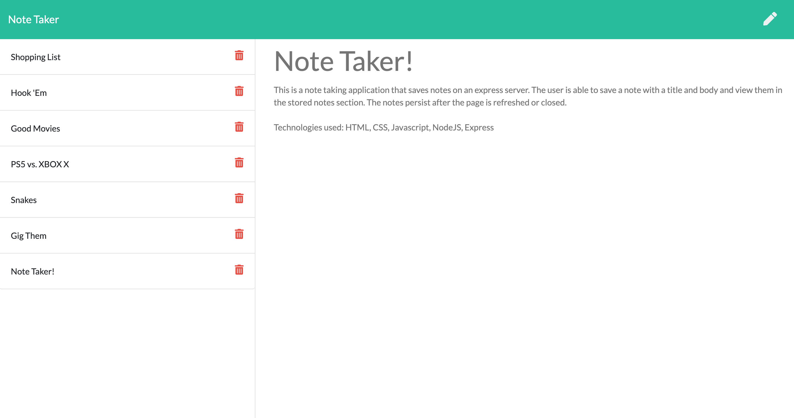

# Note-Taker

This is a note taking application that saves notes on an express server. The user is able to save a note with a title and body and view them in the stored notes section. The notes persist after the page is refreshed or closed. 

Technologies used: HTML, CSS, Javascript, NodeJS, Express

Link to deployed site: 

